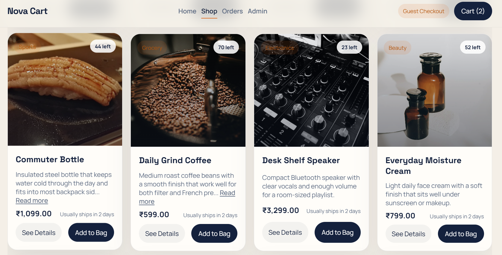
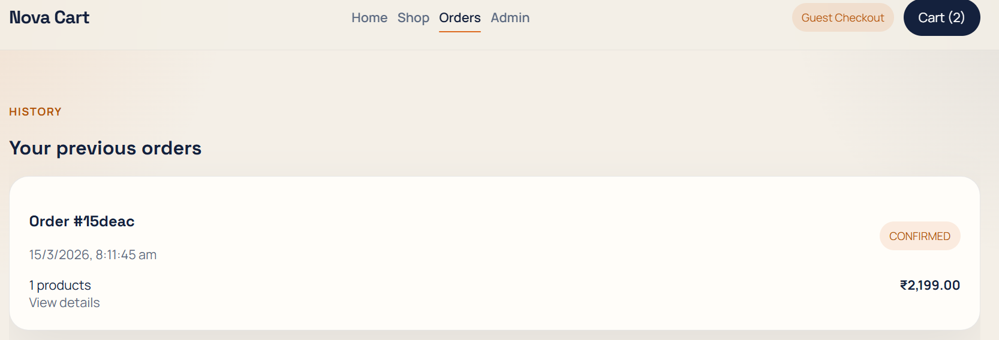
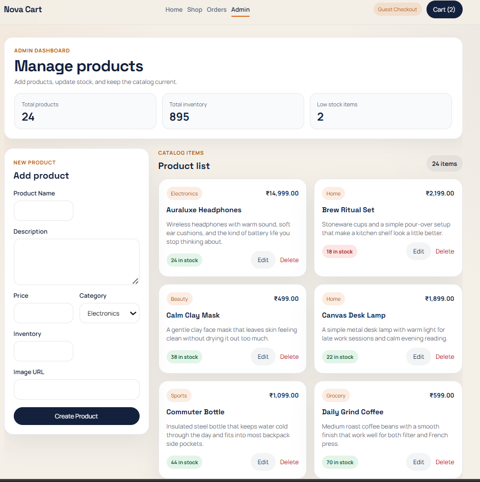
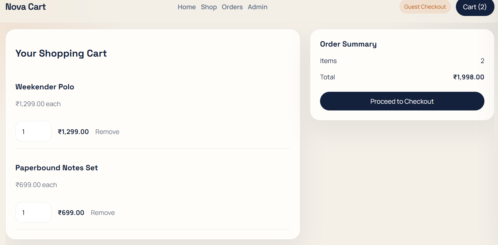

# Online Shopping Cart System

Production-ready full-stack e-commerce application built with Spring Boot, MongoDB, and React.

## Project Structure

```text
ProjectRoot/
├── backend/
│   ├── docs/
│   ├── src/
│   ├── pom.xml
│   └── .env
├── frontend/
│   ├── public/
│   ├── src/
│   ├── package.json
│   └── .env
└── README.md
```

## Features

- Product catalog with search, category filters, and product details
- Persistent MongoDB-backed shopping cart with quantity updates
- Checkout flow with async order processing using `CompletableFuture`
- Order history and order details pages
- Admin dashboard for product CRUD and inventory management

## Core Java Concepts Included

- OOP through abstract base entities, interfaces, DTOs, service abstractions, and mappers
- Collections, Streams API, lambda expressions, enums, generics, and exception handling
- Repository pattern, service layer pattern, DTO pattern, and dependency injection
- Serialization support in domain models and async processing with multithreading

## Backend Setup

1. Add your MongoDB URL to `MONGO_URI` in the backend `.env` file or terminal session.
2. Run:

```bash
cd backend
mvn spring-boot:run
```

Backend runs at `http://localhost:8081`.

## Frontend Setup

1. Create a frontend `.env` file and set `REACT_APP_API_BASE_URL` if needed.
2. Run:

```bash
cd frontend
npm install
npm start
```

Frontend runs at `http://localhost:3000`.

## MongoDB URL

Set `MONGO_URI` in your backend environment file or terminal before starting the server.

## API Documentation

- [API documentation](/C:/Users/suruh/OneDrive/Desktop/ShoppingCart/backend/docs/api-documentation.md)
- [MongoDB schema examples](/C:/Users/suruh/OneDrive/Desktop/ShoppingCart/backend/docs/mongodb-schema.md)

## Production Notes

- The backend uses layered architecture under `controller/`, `service/`, `repository/`, `model/`, `dto/`, `exception/`, `config/`, and `utils/`.
- The frontend uses `components/`, `pages/`, `services/`, `context/`, and `utils/`.
- MongoDB connection details are externalized via environment variables.

References of the site






